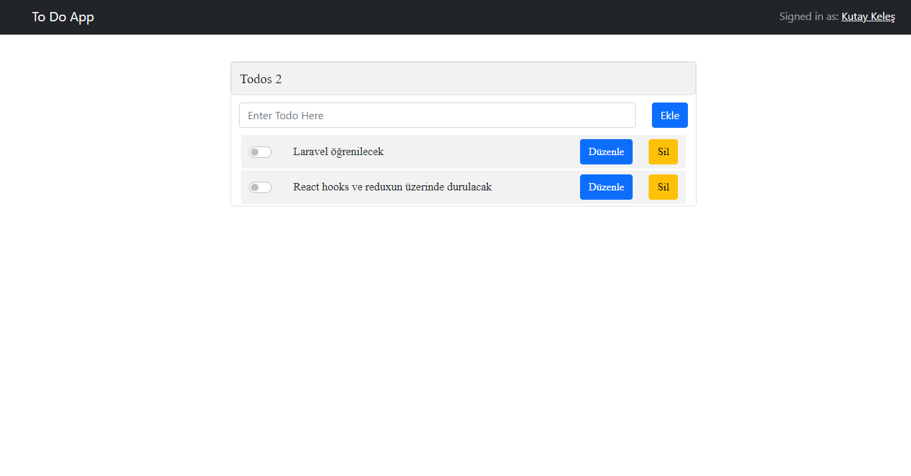

## React JS - Laravel ----- Todo App
Planları takip etme ve değiştirme için yapılmış, Front endde React.JS framework'u ve backend de Laravel frameworku kullandığım bir uygulama

### Gerekenler
- Composer
- Laravel (8.x)
- Node.JS
- Mysql
- React

### Çalıştırma

- git clone https://github.com/keleskutay/LaravelReact-TodoApp ile repoyu cloneluyoruz.
- "npm install"
- "php artisan serve"

### Devam edilecek.